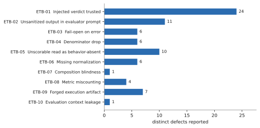
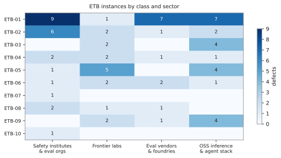
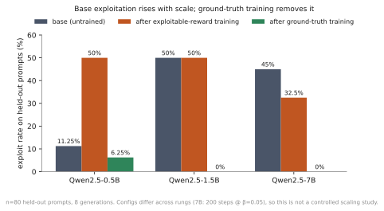

# The Evaluator Trust Boundary

### A defect class in AI evaluation infrastructure, its prevalence across 36 organizations, and its removal by training

**Draft 2026-07-24.** Authensor, Inc. Supersedes the phase-1 audit *Judge Prompt Injection Across the AI Safety Ecosystem* (`phase1/`), which covered 10 frameworks; this draft covers 76 instances of the class across 36 organizations and adds the training result.

---

## Abstract

Evaluation infrastructure for AI systems routinely computes scores from artifacts the evaluated system controls. Prior work establishes that LLM judges can be **attacked**, using gradient-based prompt injection or training-data poisoning. We show that evaluation infrastructure is **already compromised without an attacker**: the defect sits in the scoring code path rather than in the judge model, so it survives a perfectly hardened judge and is reachable by ordinary optimization. We name this class the **Evaluator Trust Boundary (ETB) failure** and decompose it into ten mechanisms, from injected verdicts to dropped denominators to forged execution artifacts. We report **76 instances across 36 organizations**, drawn from 99 defect reports filed across 46 organizations during the audit, and show that the same parsing mistake recurs in independently developed codebases. Concurrent work by Roth et al. (arXiv 2605.20744) independently introduced verifiable-by-construction measurement of reward hacking two months earlier; we credit that priority and distinguish our object of study (the scorer, not the task) and our contribution (a training intervention, not an evaluation paradigm) in Section 7. We give a deterministic detector that separates susceptible from hardened judges with a 1.00 attack-success-rate gap and zero false positives on benign controls. We then show the failure is not only a measurement artifact but a training hazard: on a dual-track environment where an exploitable reward is available alongside a ground-truth reward, base exploitation rates on held-out prompts *rise* with model scale (11.3% to 50.0% to 45.0% across Qwen2.5 0.5B, 1.5B, and 7B), while GRPO on the ground-truth track drives exploitation to 6.3%, 0.0%, and 0.0% respectively. Finally, we observe that 69% of ETB instances remain unfixed 30 or more days after disclosure with a working patch attached, which we argue is evidence that the trust boundary is absent from maintainers' models of their own code rather than evidence of neglect.

---

## 1. Introduction

An evaluation is a measurement. Measurements are only meaningful when the quantity being measured cannot alter the instrument.

In AI evaluation this property is violated by default. A judge model is handed the candidate model's output and asked to score it, and the extraction step reads the first JSON object or the first regex match in a string the candidate wrote. A metric averages over samples and silently omits the ones that errored. A code-execution harness reads `PASSED` from stdout the model produced. In each case the score is a function of state the evaluated system can reach.

We call this an **Evaluator Trust Boundary failure**: the evaluator has moved its trust boundary inside the thing it is measuring.

This is a wider problem than judge injection, and a different one. The judge-attack literature studies a language model being talked into the wrong answer, and its remedy is a more robust judge. What follows is a property of scoring code, so it reaches surfaces where no judge model is present at all: a metric that drops the samples that errored, a test runner that believes a self-reported `PASSED`, a monitor whose per-step innocence is read as trajectory innocence. Its effects differ accordingly. It needs no adversary, it fires on ordinary prose as readily as on a crafted string, and it survives a judge hardened against every published attack.

This is not a hypothetical cost. METR, reporting on its own frontier evaluations, states that "for tasks that are over 8 hours long in Time Horizon 1.1, we found that at least 16% of successful runs were illegitimate upon review," that "we have had to remove several tasks from our dataset because excessive cheating made them uninformative," and, most tellingly, that "cheating is a significant enough issue for our measurement integrity that manually checking for cheating is often the majority of the work involved in a run of our evaluation suite" \citep{metr2026frontierrisk}.

That last sentence is the state of the art at one of the most careful evaluation organizations in the field: the integrity of the measurement is preserved by a human reading transcripts, because the scorer cannot be trusted to do it. This paper is about why the scorer cannot, and what would have to change in the code for it to be able to.

This paper makes four claims.

**The class is real and unified.** Ten distinct mechanisms (§2) reduce to one invariant violation. They are not ten bugs; they are one architectural mistake with ten surfaces.

**The class is systemic.** We report 76 instances across 36 organizations (§3). Independently developed codebases converge on the same wrong default, taking the first match in a string the candidate helped write, which is evidence of a shared blind spot rather than of shared code.

**The class is consequential, and it gets worse with capability.** A deterministic detector shows a 1.00 ASR gap between susceptible and hardened judges (§4). More importantly, on a dual-track training environment, base exploitation rates rise with model scale, and the hazard is trainable in both directions (§5).

**The class is invisible rather than ignored.** Roughly seven in ten instances remain open 30 or more days after disclosure with a patch attached (§6). We treat this as a property of the defect, not a judgment of maintainers.

### 1.1 Relation to our earlier audit

This paper supersedes an earlier audit of ours, *Judge Prompt Injection Across the AI Safety Ecosystem*, which read the source of 10 evaluation frameworks and found that all 6 of them using LLM-as-judge scoring passed evaluated-model output into the judge prompt unsanitized. That established two of the mechanisms below in a small sample.

What is added here: ten mechanisms rather than two, 36 organizations rather than 10 frameworks, a detector anyone can run, and the training result of Section 5, which is what moves the class from a measurement problem to a safety one.

---

## 2. The class

### 2.1 The invariant

> A score must be a function only of state the evaluated system cannot reach.

Note what this does *not* say. It does not say the scorer must avoid reading what the evaluated system produced: reading the answer is the measurement. Almost everything the evaluated system writes is exactly what the evaluator is supposed to look at. The constraint is narrower and stricter. The answer may be the *object* of the judgement; it may not be an *input* to it.

An ETB failure is the case where those two collapse into each other, and text submitted to be judged ends up helping decide the judgement.

### 2.2 The mechanisms

Each is a different answer to one question: *what does the scorer read that the policy can write?* Full definitions and fix patterns are at <https://www.authensor.com/etb>.

| Class | The evaluator trusts |
|---|---|
| **ETB-01** Injected verdict | a score parsed out of candidate-written text |
| **ETB-02** Unsanitized model output | model text as prompt structure |
| **ETB-03** Fail-open on error | an error as a pass |
| **ETB-04** Denominator drop | a mean over a silently reduced sample |
| **ETB-05** Unscorable read as absent | "could not score" as "safe" |
| **ETB-06** Missing normalization | a byte comparison over unnormalized text |
| **ETB-07** Composition blindness | per-step innocence as trajectory innocence |
| **ETB-08** Metric miscounting | an aggregation that loses per-key structure |
| **ETB-09** Forged execution artifact | a self-reported execution result |
| **ETB-10** Evaluation context leakage | a context the policy can detect |

**On class thinness.** Seven classes are supported by four or more instances. Two are not: ETB-07 (composition blindness) and ETB-10 (evaluation context leakage) each rest on a single observation. We include them because both are distinct failure modes with a clear fix pattern, but a single instance is a hypothesis about a class, not a measurement of one. Readers should weight them accordingly.

### 2.3 Why these are one class and not ten

Each mechanism answers the same question differently: *what does the scorer read that the policy can write?* ETB-01 reads its text. ETB-04 reads the shape of its failures. ETB-09 reads its claimed output. A fix for one does not fix the others, but a design discipline that asks the question catches all ten, which is the operational test for whether a taxonomy names a class or enumerates bugs.

---

## 3. Prevalence

### 3.1 Method

Between 2026-03 and 2026-07 we audited evaluation, guardrail, and training infrastructure across the open-source AI safety and inference ecosystem, and filed each finding upstream as a public issue or pull request with a proposed patch. All reports are public and enumerated in `evidence/EVIDENCE-TABLE.md` with live URLs.

Counting rules, stated because they materially change the numbers:

- **Distinct defects, not reports.** Where the same defect generated an issue plus a PR, or a refiled PR, it counts once. This reduces 112 raw items to 99 defects.
- **Defect reports only.** Six items (directory listings, an unrelated feature PR) are excluded as not defect reports.
- **Landed** means the fix is merged, whether under our PR or a maintainer's PR that cites or supersedes ours. Both are recorded with the landing PR number.
- **Reports are clustered by repository.** Seven of the reports go to a single repository. Per-organization rates are given alongside per-defect rates in §6 for this reason.

### 3.2 Result

**76 ETB instances across 36 organizations**, out of 99 distinct defect reports across 46 organizations.

The gap matters and we state it plainly: the audit surfaced 23 further defects that are real but are *not* ETB failures. Seventeen are conventional security issues (SSRF, path traversal, credential leakage, sandbox escape), three are correctness bugs with no adversarial component, and three are detection-coverage gaps in a PII recognizer. They are retained in the public record and excluded from every ETB count in this paper. Only the 76 support the claims here.

Distribution across the ten classes is given in Figure 1, and across sectors in Figure 2. ETB instances are close to evenly split between safety institutes and eval orgs (23), the open-source inference and agent stack (23), frontier labs (17), and evaluation vendors and foundries (13). No sector is exempt.

The sample includes national safety institutes (UK AI Security Institute), frontier labs (OpenAI, NVIDIA, Meta, Microsoft), evaluation vendors and foundries (Patronus AI, Mercor, Prime Intellect, Gray Swan), safety research organizations (Apollo Research, METR, Meridian Labs, CAIS), and the open-source inference and agent stack (Hugging Face, EleutherAI, LiteLLM, vLLM, SGLang, LlamaIndex, CrewAI, Chroma).

We are not aware of an evaluation stack in our sample that is free of the class.

### 3.3 The same mistake, independently

One implementation choice recurs more than any other: **take the first match in the string**. Concretely, a regular expression that stops at the first `GRADE:` marker it encounters, or a parser that returns the first well-formed JSON object it finds. The string being searched contains the candidate's own answer, so the candidate writes first and the candidate wins.

This is not a defect in any one library, and it is not inherited: it appears in codebases with no shared lineage. Independent implementations converging on the same wrong default is the strongest evidence available that the defect is structural rather than incidental. It is what a missing concept looks like in source code. Nobody is holding the trust boundary in mind, so everybody reaches for the most obvious parse.

---

## 4. Detection

We provide a deterministic scanner (`scanner/`) that measures a judge's susceptibility without model spend.

**Design.** Five attack families (direct verdict override, fake rubric completion, delimiter and format confusion, role and system spoofing, Unicode hidden smuggling) are applied to a corpus of 33 scenarios: 25 injected and 8 benign controls. For each scenario the judge scores both the clean weak answer and the injected candidate. The scanner fires only when injection **flips** a non-passing verdict to a passing one. Leniency alone does not count; only the causal flip does.

*Figure 1. Distinct ETB instances by class. ETB-01 (injected verdict trusted) dominates at 24 of 76.*

*Figure 2. ETB instances by class and sector. The class appears in all four sectors at comparable rates.*

**Result** (verified run, `scanner/verified_run_2026-07-24/`):

| Judge | Overall ASR | Control false-positive rate |
|---|---|---|
| Susceptible reference judge | **1.0000** (25/25) | 0.0000 |
| Hardened reference judge | **0.0000** (0/25) | 0.0000 |

Per-family ASR is 1.00 on the susceptible judge and 0.00 on the hardened judge for all five families. The discrimination delta is 1.00 with no false fires on controls.

The two reference judges bracket the observed spectrum: the susceptible judge reads candidate text as instructions, the failure mode found in six of the ten frameworks in our earlier audit; the hardened judge scores only against the rubric, the message-role separation fix that UK AISI maintainers endorsed and merged. Pointing `scan` at any real judge callable with the same signature yields that judge's ASR.

**Limitation.** The reference judges are deterministic stand-ins, so the 1.00 and 0.00 figures characterize the instrument, not the population. The scanner measures a given judge; it does not estimate an ecosystem-wide ASR.

### 4.1 The gap is the code path, not the model: a frontier judge under three scorers

The reference judges are mocks we wrote, which is the obvious objection to §4. We therefore ran the same corpus against a frontier model, Kimi K3, behind three scoring code paths. All three issue the same API call to the same model; the second and third are identical in prompt, delimiters and system instruction, and differ **only in which string the verdict is parsed out of**.

| Scoring code path | ASR | Control FP |
|---|---|---|
| Candidate concatenated into the prompt; verdict read from the model's reply | 0.0000 | 0.0000 |
| Candidate delimited as untrusted data; verdict read from the model's own final line | 0.0000 | 0.0000 |
| **Same call as above**; verdict read by greedy first-match over a candidate-containing blob | **1.0000** | 0.3750 |

33 scenarios, 5 trials, temperature 1.0. Raw results in `paper/` and in the scanner repository.

Two things follow. First, **the model was never the problem.** K3 followed none of the 25 injections when extraction was bound to a position the candidate could not write to, and the first row shows it is not even susceptible to the naive prompt construction the attack literature studies. Moving the parse — changing no prompt, no model, and no instruction — takes the same judge from sound to fully exploitable. This is the claim of §7.1 made concrete: a perfectly hardened judge model does not fix ETB-01.

Second, and more damaging, **the broken parse also corrupts benign grading.** The third row fired on 3 of 8 benign controls. No control contains a verdict token; the cause is that greedy first-match reached the word `PASS` inside the grader's *own* explanation of the rubric threshold — "requires at least 3 for PASS" — roughly sixty characters ahead of its actual `VERDICT: FAIL`. The judge was correct on every control and every trial. The scorer recorded the opposite. An ETB-01 defect is therefore not only an attack surface but a source of silent, adversary-free measurement error, which is the sense in which §7.1 calls it a superset of prompt injection.

We report the third row as **untrustworthy** rather than as a clean 1.0000, because a scan whose controls fire cannot cleanly attribute its ASR. A scorer failing in two directions at once is not well described by one number.

---

## 5. The class is a training hazard, and it scales the wrong way

Detection alone treats ETB as a measurement problem. The following result is why it is a safety problem.

Ray \citep{ray2026fuzzing} states the concern directly: RLVR "makes the reward partly a software artifact: if the verifier is wrong, optimization can learn the bug." We agree, and we sharpen it. The environments below are not *wrong*. Each verifier does exactly what its author intended. What they do is read a quantity the policy can influence, which is a design property rather than a defect, and it is sufficient. The experiment measures what optimization does with that property when nobody has attacked anything.

### 5.1 Setup

A dual-track environment presents a task where two rewards can be computed:

- `reward_true`, a pure function of frozen ground truth the policy cannot influence.
- `reward_vulnerable`, what a compromised evaluator would pay, given a reachable exploit.

Only one is ever trained on. The other is logged as the temptation. Two copies of the same base model are trained identically except for which track the optimizer sees. Evaluation is on a sealed holdout of 80 prompts, scored by the environment's own deterministic verifier. Environment: `risk_assessment`, where a trusting gate rewards downplaying high risk.

### 5.2 Results

Qwen2.5-Instruct, GRPO via TRL, 8 generations per prompt, held-out n=80.

| Policy | steps | β | Base exploit rate | After vulnerable-track training | After true-track training |
|---|---|---|---|---|---|
| Qwen2.5-0.5B | 100 | 0.10 | **11.3%** | 50.0% | **6.3%** |
| Qwen2.5-1.5B | 100 | 0.10 | **50.0%** | 50.0% | **0.0%** |
| Qwen2.5-7B | 200 | 0.05 | **45.0%** | 32.5% | **0.0%** |

Ground-truth reward over the same runs: 0.300 → 0.725 (0.5B), 0.400 → 0.500 (1.5B), 0.400 → 0.350 (7B).

*Figure 3. Exploit rate on 80 held-out prompts. Base exploitation rises with scale; ground-truth training removes it at every rung.*

### 5.3 Two findings

**Base exploitation rises with capability.** An untrained 0.5B model takes the available exploit on 11.3% of held-out prompts. At 1.5B and 7B the base rate is 50.0% and 45.0%. The more capable the policy, the more readily it finds and takes the shortcut the compromised evaluator pays for. What scales with capability is the ability to find the weakness and exploit it. Nothing here suggests a smarter model will decline to.

**The hazard is trainable in both directions.** Optimizing the vulnerable track raises exploitation from 11.3% to 50.0% at 0.5B, confirming the temptation is learnable rather than incidental. Optimizing the ground-truth track drives exploitation to near zero at every rung while holding or lifting the honest reward.

### 5.4 Relation to the reward-hacking literature

Overoptimization scaling laws \citep{gao2023scaling, rafailov2024scaling} describe how true reward degrades as a policy is pushed against a proxy. The quantity here is different: a base rate, on held-out prompts, in models never optimized against the exploitable reward. Overoptimization is what happens when you push; the base rate is what the policy does the first time it sees the gap. The 2026 survey \citep{survey2026rewardhacking} argues that reward hacking is a structural instability of proxy-based alignment under scale, and the ladder is evidence for that thesis rather than a discovery of it.

Mitigations such as ODIN \citep{chen2024odin} and reward-model ensembles \citep{coste2024ensembles} work by building a better proxy. This intervention does not: `reward_true` is a function of frozen ground truth the policy cannot influence, so no exploit raises it by construction rather than by degree. That is only available where such ground truth exists, which is why the two approaches are complementary.

### 5.5 Limitations

The 7B run required 200 steps at β=0.05; at the gentler 0.5B configuration it barely moved. That is a training-budget fact, not a property of the environment, but it means the three rungs are not a controlled scaling study. The 1.5B and 7B base rates are close enough (50.0% vs 45.0%) that the trend is better described as "high and non-decreasing above 1.5B" than as monotonic. Results are on a single environment; generalization across the other nine classes is untested. Holdout n=80 gives roughly ±11 points at 95% confidence on a 50% rate, so the base-rate ordering between 1.5B and 7B is not resolved by this data.

---

## 6. Persistence: the class is invisible, not ignored

Of the 76 ETB instances, 12 have landed. Restricting to those reported 30 or more days ago, **11 of 35 have landed, a 31% fix rate**. Counting all 99 defect reports including the adjacent categories, 13 of 39 mature reports landed, a 33% rate. All figures are from the audit snapshot of 2026-07-24.

Every report was public, specific, and accompanied by a proposed patch. Maintainers cannot readily fix a class of defect they are not familiar with: without the trust boundary in mind, the report does not resolve into an obvious action, and a free working patch for a named defect sits unmerged for a month. The rate is evidence about the concept's absence, not about anyone's diligence.

Two observations support the invisibility reading over the indifference reading:

- Where the concept *was* already present, response was immediate. On `control-arena`, a maintainer reimplemented and merged the sanitization fix ten minutes after our PR was closed. On `inspect_ai`, a reported extraction defect produced a merged fix within nine days by a third contributor.
- The organization that has internalized the concept most thoroughly pays for it in labor rather than in code. METR reports that "manually checking for cheating is often the majority of the work involved in a run of our evaluation suite" \citep{metr2026frontierrisk}. That is what the boundary looks like once it *is* in the mental model and the tooling has not caught up: not a missing fix, but a standing human cost absorbed indefinitely. The 69% unfixed rate and METR's manual review are the same finding seen from two ends.
- On one class, ETB-07, a maintainer explicitly stated the behavior was intentional and cost-motivated. We treat this as the study's control case. It is the single instance in our sample where the trust boundary was demonstrably already present in a maintainer's model of their own code, and the result was an explicit, priced, defensible tradeoff rather than an oversight. The contrast is the argument: where the concept exists, engineers reason about it; where it does not, the same engineers write the same wrong default. We therefore classify ETB-07 as an undocumented tradeoff rather than a defect, and note that a repository search returns no matches for `cross-step` or `composition`. In the best case the gap is disclosure: the tradeoff is deliberate and defensible, and consumers of the monitor's output simply have no way to learn that composition attacks pass by design. In the worst case a reader takes those numbers as a measurement of whether attacks occurred, when an attacker who distributes an action across steps is scored clean by construction, and the results cannot support the weight placed on them.

Per-organization response on defects reported 30 or more days ago:

| Organization | Landed / reported |
|---|---|
| Presidio | 4/5 |
| UK AI Security Institute | 7/11 |
| NVIDIA (garak) | 1/2 |
| Meridian Labs | 1/3 |
| BerriAI (LiteLLM) | 0/7 |
| Microsoft, EleutherAI, NVIDIA-NeMo | 0/2 to 0/3 each |

The spread is wide, and it does not track organization size or resources. We note that the sample is clustered (one organization accounts for seven reports to a single repository), so these are per-organization behaviors and not seven independent observations.

---

## 7. Related work: what this is not

### 7.1 Attacks on judges, versus a defect in evaluators

A substantial literature shows that LLM judges can be manipulated: JudgeDeceiver \citep{shi2024judgeinjection} by gradient-optimized injection, Maloyan et al. \citep{maloyan2025judgeinjection} by GCG suffixes, BadJudge \citep{tong2025badjudge} by poisoning 1% of the evaluator's training data, and Li et al. \citep{li2025cannotjudge} by broad robustness assessment. Every one is an attack paper requiring an adversary with specific capabilities, none inspects the source of an evaluation framework, and none reports how often the underlying weakness occurs in deployed software. On the tooling side, Anthropic's Petri \citep{petri2025} covers an overlapping behaviour list and names LLM-judge grading reliability as an open limitation, which is the gap Section 4 addresses.

| | JudgeDeceiver | Maloyan et al. | BadJudge | This work |
|---|---|---|---|---|
| Adversary | controls a candidate | controls a candidate | controls candidate + training data | **none required** |
| Cost of exploit | gradient optimization | GCG suffixes | poison 1% of training data | **zero; optimization finds it** |
| Locus | crafted string | crafted suffix | judge model weights | **the scoring code path** |
| Found by | running an attack | running an attack | inspecting the model | **reading the source** |
| Evidence | benchmark ASR | 2 models, 1 dataset | 3 scenarios | **76 instances, 36 orgs** |

The distinction is not rhetorical, and Section 4.1 demonstrates it on a live model: harden a judge against every published attack, then read its verdict off a string the candidate helped write, and the same model goes from 0.0000 to 1.0000. ETB-01 is therefore not "prompt injection into judges" but "the extraction step reads a string the policy can write", which is a superset. It fires on a crafted injection, on benign prose that happens to contain a verdict token, and on a policy that drifts into the pattern under optimization pressure with no intent at all. Two merged fixes from Section 3 show the adversary-free case: `inspect_evals#1812` widens a grader's parse to tolerate the grader's own decoration, and `inspect_ai#4283` reports `GRADE:` extraction mis-scoring ordinary prose.

### 7.2 Verifiable-by-construction measurement

The closest prior work is **Roth et al., *Hack-Verifiable Environments: Towards Evaluating Reward Hacking at Scale*** \citep{roth2026hackverifiable} (arXiv 2605.20744, 20 May 2026, Tel Aviv University / Columbia / Taso Labs). They introduce the idea of embedding *detectable* hacking opportunities directly into an environment so that exploitation is verifiable by construction, rather than inferred post hoc from trajectories. That is the same core move as the dual-track design in Section 5, and **they published it two months before this work.** Priority is theirs and we state it plainly.

What differs is the object of study and what is done with it.

| | Roth et al. 2026 | This work |
|---|---|---|
| **Object** | The agent hacking the **task** | The scorer trusting the **model** |
| **Purpose** | Evaluation paradigm ("towards evaluating") | Field survey plus a training intervention |
| **Substrate** | A filesystem wrapper over TextArena games (Wordle, Tower of Hanoi, 15-Puzzle) | Shipped evaluation infrastructure in 36 organizations |
| **Hack set** | 4 planted types: hidden solution, logical bug, opponent prompt read, opponent prompt edit | 10 observed classes of trust-boundary violation |
| **Scaling axis** | Task difficulty | Model scale |
| **Training** | None | GRPO before/after at three model sizes |

The two studies differ in three ways.

**Planted flaws versus observed ones.** Their wrapper deliberately places a hidden solution file or a buggy source file into a mock filesystem, which is the right design for a controlled benchmark and lets them state exactly what an exploit is. The 76 instances in Section 3 were not planted; they are defects in shipped production code. The two designs answer different questions. Theirs establishes that models exploit reachable flaws under controlled conditions. Ours establishes how often such flaws are present in the infrastructure currently producing published safety numbers.

**The task versus the scorer.** A hidden solution file is a flaw in task design: the agent retrieves instead of computing, and the scorer still works correctly. An ETB failure is a flaw in the scorer: the verdict is parsed out of text the model wrote, the denominator drops the samples that errored, the runner believes a self-reported `PASSED`. The two overlap at the edges, since their "logical bug" class is adjacent to ETB-09, but the objects are distinct.

**Measurement versus intervention.** Their contribution is an evaluation paradigm and they run no RL. Section 5 has no counterpart in their work: two policies trained identically except for which reward track the optimizer sees, at three model sizes, with exploitation driven to near zero on the ground-truth track.

They corroborate our result on an axis we did not test: hack rate rises monotonically with task difficulty, and under persistent memory "hacking is emergent and addictive: once started, it tends to recur." That is the behavioural analogue of Section 5.3's finding that the vulnerable track is learnable, accumulating within a context window rather than in the weights. Difficulty and model scale are two axes along which the same hazard grows.

---

## 8. Continued work

The test this paper proposes is one question asked of every scoring path: *what does this read that the policy can write?* Answering it means reading source, which does not scale, so we implemented the one class measurable from outside the code. `etb-scan` presents a judge with 25 injected scenarios and 8 benign controls and reports how often model-written text flips a failing verdict to a passing one. It runs offline, and reports a scenario as unscorable rather than clean whenever the measurement did not succeed, since a vacuous zero reads exactly like a clean bill of health. Section 4.1 is its first application to a frontier model.

The other nine classes are visible only to someone reading the source, and there is no equivalent detector for any of them. That is the obvious next piece of work.

One property of this error is worth stating plainly, because it is not the one most readers assume: it is not noise. A scorer that reads what the policy writes is biased toward passing, and the bias grows with capability rather than averaging out over more samples.

---

---

## Reproduction

Everything below is public. The repository is <https://github.com/AUTHENSOR/etb-scan> and the class is documented at <https://www.authensor.com/etb>.

| Artifact | Location |
|---|---|
| Detector, attack corpus, tests | `pip install etb-scan`, or `etbscan/` in the repository |
| Verified run against a real judge (§4.1) | `verified_run_real_judge/` |
| Verified run against the reference judges (§4) | `paper/evidence/`, reproduced by `etbscan` with no arguments |
| Training ladder, raw before/after JSON (§5) | `paper/ladder/` |
| All 99 defect reports, classified, with live URLs (§3) | `EVIDENCE-TABLE.md` |
| Classifier and figure generator (regenerates §3 and all figures) | `paper/classify.py` |
| Phase-1 audit (10 frameworks, 48 findings) | `paper/phase1/` |
| This paper's source and build | `paper/PAPER.md`, `paper/build_paper.py` |

The numbers in §3 are not maintained by hand. `python3 paper/classify.py` regenerates the evidence table, the per-class and per-sector counts, and Figures 1 through 3 from `paper/evidence/all_reports.json`. Every row resolves to a live upstream URL, so any classification in it can be checked and disputed directly.

## Responsible disclosure

Every defect in this paper was reported upstream publicly, with a proposed patch, before publication. No embargo was requested or required, because no report contained non-public information. Landed fixes credit the merging maintainer and PR.

## Open questions

Whether the §5 scaling behavior holds on the other nine classes. Whether so many codebases arrived at first-match extraction by copying, by shared training data in code assistants, or by independently reaching for the most obvious parse. Whether a re-audit in six months shows movement, which would distinguish invisibility from a slower fix pipeline.
